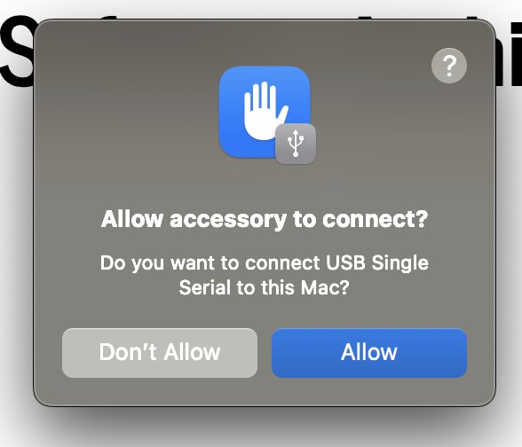
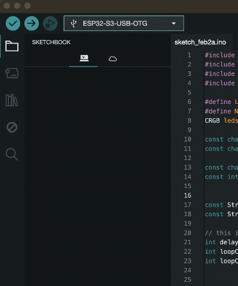
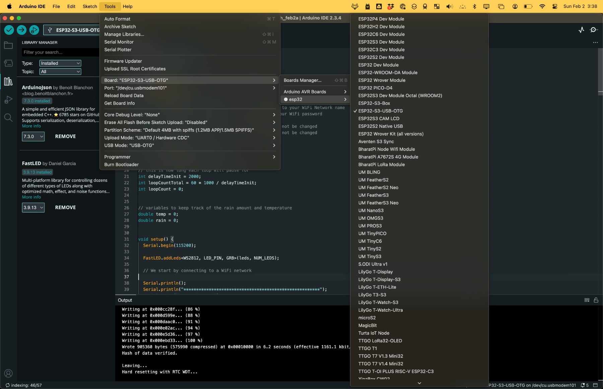
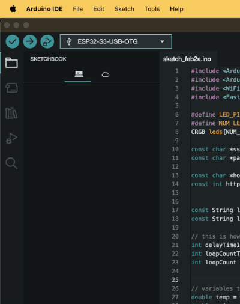

# A School Chat

## Slides

- [February 3rd, 2025](feb_3_2025/slides/content)

_Also see "running slides" below!_

## Random links / thoughts

- [Learn markdown](https://www.markdowntutorial.com/) - useful for programming but also in Google docs / drive and many other places!
- [Ollama](https://ollama.com/) is a great way to experiment with AI for free in programming projects on your computer - read a bit about their [API](https://github.com/ollama/ollama/blob/main/docs/api.md) and checkout libraries for your favorite programming language (Python, JavaScript, etc)
- Current trends in software development and programming in [the Stack Overflow Survey](https://survey.stackoverflow.co/2024/)
- Learn basics of web development and git (version control system) at the same time [and make a simple webpage on github](https://pages.github.com/)
- [Godot](https://docs.godotengine.org/en/stable/community/tutorials.html) is a good place to start if you want to learn about video game creation. It can be tough, but the tutorials section has some good learning resources, e.g. [this interactive tutorial!](https://gdquest.github.io/learn-gdscript)
- [Figma](https://www.figma.com) - a popular tool for doing web and app design
- [Blender](https://www.blender.org/) - a free (though incredibly complicated!) and amazing tool for doing 3D modeling and rendering
- A bit of random history - [Steve Jobs announcing the first iPhone](https://www.youtube.com/watch?v=VQKMoT-6XSg)
- [Reveal.js](https://revealjs.com/) - the tool I used to make these slides


## Arduino / Freenove ESP32-S3

The board provided is an ESP32-S3 based dev board, specifically the [Freenove ESP32-S3 WROOM Lite](https://github.com/Freenove/Freenove_ESP32_S3_WROOM_Board_Lite). This board can be programmed many different ways (e.g. C, C++, Python, etc) to do many different things, _but it can be a bit tricky to get started with_. Be prepared for a real challenge and one that you may need to revisit in the future!

**Again, to get this board working and even do a simple thing like making an LED blink may require a lot of work, research, troubleshooting, etc. Set your expectations accordingly!**

### Things this board can do:

1. Connect to the internet over WiFi (through your home wireless network for example)
2. Act as a web server, allowing you to connect to it to view simple webapges
3. Act as a bluetooth device or connect to other bluetooth devices
4. It has many input and output pins, so you can (for example) connect it to switches or LED lights
5. Many other things!

You could create a weather station with it, or a simple home security system, or create a game, or work with a friend to connect your devices over the internet to create a simple communication device, etc.

### My process

Note that the hardest part of using the ESP32-S3 dev board is just getting started. Each computer system will be a bit different and the exact steps you need to take to be able to program the chip will be different. _Below I'll give a few steps that worked for me on my Mac, but depending on your system you'll need to tweak things  a bit!_

1. [Download and install the Arduino IDE for your system (Mac, Windows, etc)](https://www.arduino.cc/en/software)
2. After the Arduino IDE is installed, open it
3. Now plug the ESP32 dev board into your laptop with a USB-C cable - **note that there are two USB-C ports on the board and the port you choose will depend on how you setup your board** - in my case, on a Mac, I use the port labeled `USB-OTG` (on the back of the board). _This part is important: if you have issues with connecting through the USB-OTG port, the other port labeled with UART should work more reliably but may require you install a "driver" on your computer, a special piece of software that lets your computer talk with the device. There are more instructions on how to do this in the troubleshooting guide below if you follow the links in the "Official Tutorial" section_.
4. _It's likely your computer will pop up a message and ask if you are OK allowing the board to connect to your computer - choose yes / accept_ (something similar to below on a Mac)



5. Now, within the Arduino IDE on the left menu choose the "board manager" icon, search for "esp32", and click "install" (this will take a while)



6. Once the install process has completed, from the `Tools` menu choose `Board` -> `esp32` -> `ESP32-S3-USB-OTG` (note the `OTG` here and the `USB-OTG` port we plugged the USB-C cable into above!). _This may prompt you to select a "port", at which point you will hopefully have an option similar to_ `/dev/cu.usbmodel101` _or similar, ideally something marked as "ESP32"_. On occasion unplugging the ESP32 dev module and plugging it back in might result in a new option showing up. Sometimes quiting the Arduino IDE and restarting / reselecting the board might help. If not, this may be a good time to take a step back and take a look at the tutorial below! Here are my settings:



7. The following snippet of code should be a very basic sketch ("sketch" is what the Arduino platform calls a program or project) that should work on your dev board. It's probably better to find a tutorial on the internet about the basics of Arduino and how to use the Arduino IDE, but basically clicking "file -> new"  and pasting the below code in, then clicking the `Upload` button in the top left corner (looks like an arrow) is what you need to do.

```c++
#define RGB_BRIGHTNESS 64 // Change white brightness (max 255)
// note this number, 48, coresponds with the pin 48 you can see in this
// schematic: https://github.com/Freenove/Freenove_ESP32_S3_WROOM_Board_Lite/blob/main/ESP32S3_Lite_Pinout.png
// to go really deep, if you google "WS2812" (which is what the schematic says pin 48 is hooked to!) you 
// can find tons of technical details on the LED https://cdn-shop.adafruit.com/datasheets/WS2812.pdf - cool!
#define RGB_BUILTIN 48

void setup() {
  // No need to initialize the RGB LED
}

// the loop function runs over and over again forever
void loop() {
  digitalWrite(RGB_BUILTIN, HIGH);  // Turn the RGB LED white
  delay(1000);
  digitalWrite(RGB_BUILTIN, LOW);  // Turn the RGB LED off
  delay(1000);

  rgbLedWrite(RGB_BUILTIN, RGB_BRIGHTNESS, 0, 0);  // Red
  delay(1000);
  rgbLedWrite(RGB_BUILTIN, 0, RGB_BRIGHTNESS, 0);  // Green
  delay(1000);
  rgbLedWrite(RGB_BUILTIN, 0, 0, RGB_BRIGHTNESS);  // Blue
  delay(1000);
  rgbLedWrite(RGB_BUILTIN, 0, 0, 0);  // Off / black
  delay(1000);
}
```

8. Finally, note that if you want to see the _exact_ code I have running on the example board, you can see it [here](feb_3_2025/arduino/feb_3_2025.ino). Note that you will need to first be able to program the board (step 7 is a great place to start - if you can make the LED on the board blink with this simple sketch you're 90% of the way there!), and you'll have to install two "libraries" (these are bits of code that are needed by the simple sketch I wrote):




### Official Tutorial

This is the official tuotrial provided by Freenove (the board manufactorer). It might be a good idea to read through this and follow the steps provided, however you can also try to find other video tutorials by searching on YouTube for "esp32 arduino tutorial" for example.

- [Documentation from Freenove: https://github.com/Freenove/Freenove_ESP32_S3_WROOM_Board_Lite](https://github.com/Freenove/Freenove_ESP32_S3_WROOM_Board_Lite)
- [Tutorial from Freenove](https://github.com/Freenove/Freenove_ESP32_S3_WROOM_Board_Lite/archive/refs/heads/main.zip)


## Running Slides

_Note: these slides use `Reveal.js`, although to be perfectly honest I have mixed feelings about this tool._ Regardless, you'll need to know a bit about how to interact with a simple npm project to actually see these slides. How to install npm and such is outside of the scope of this document, but basically to view the slides you'd need to:

1. install node / npm 
2. in the `slides` directory run `npm install` followed by `npm start`
3. visit [localhost:8000](http://localhost:8000)
